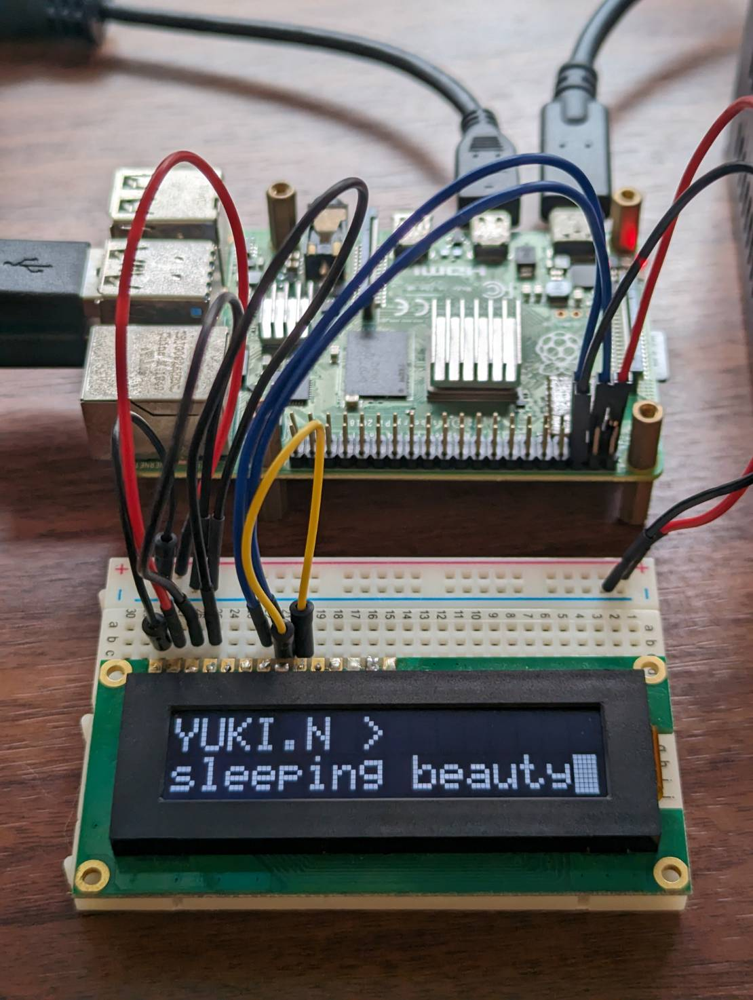
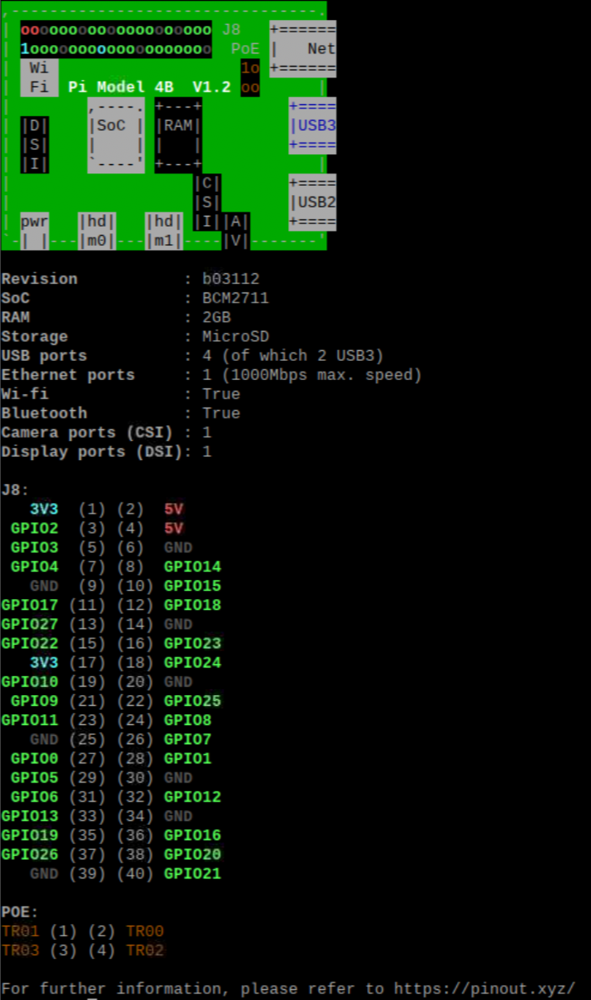

# nagato-character-display

[](https://codespaces.new/Yoshida24/nagato-character-display)

The Melancholy of Haruhi Suzumiya ep 14.



## Usage

### Supported Platform:
- Raspberry Pi OS (Raspbian GNU/Linux 11 bullseye 64bit on Raspberry Pi 4 Model B 2GB)

### Device
- Character Display: SO1602AWWB-UC-WB-U

### Dependencies
- Python 3.9
- pip 20.2.3

## Setup

### install dependencies

```bash
python -m venv .venv && . .venv/bin/activate
pip install -r requirements.txt
```

### curcuit
Assemble the circuit using the image as a reference.

pinout: 



## Execute 

### Nagato app

```bash
python src/nagato_app.py
```

### Other app

```bash
python src/other_app.py
# example
# python src/clock_app.py
```
